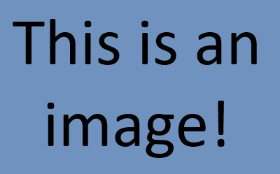

# Design Task Template
This is the README for a design task project! You can edit this in browser or via a text editor of your choice. This is a great place to include design notes and messages to the next group.

Here's some more template text to get you going:

# This is a title!

## This is a heading!

### This is a sub-heading!

```
This is a block of code!
```



Have fun! Please ask your practical demonstator or reach out to the unit convenors with any questions.
